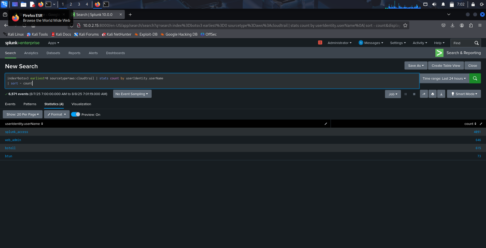
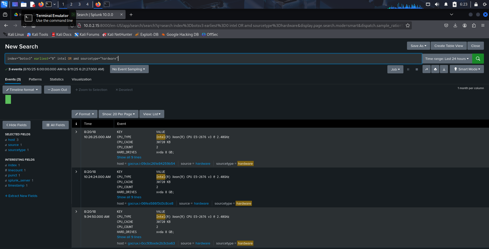
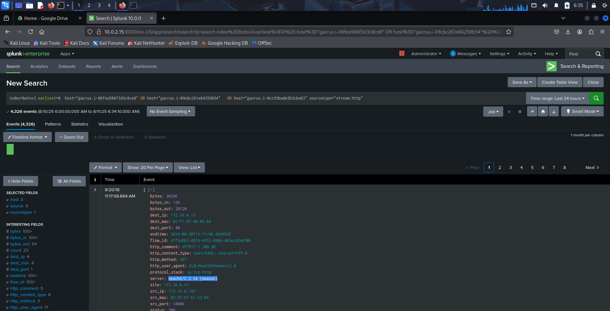
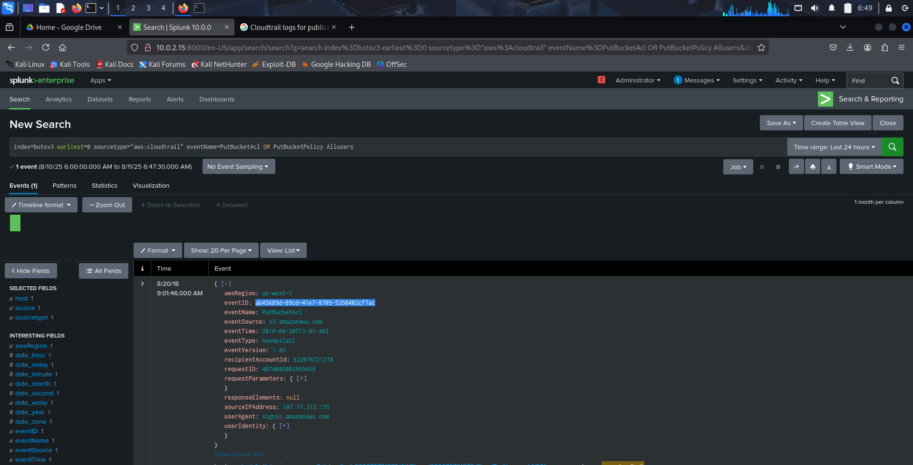
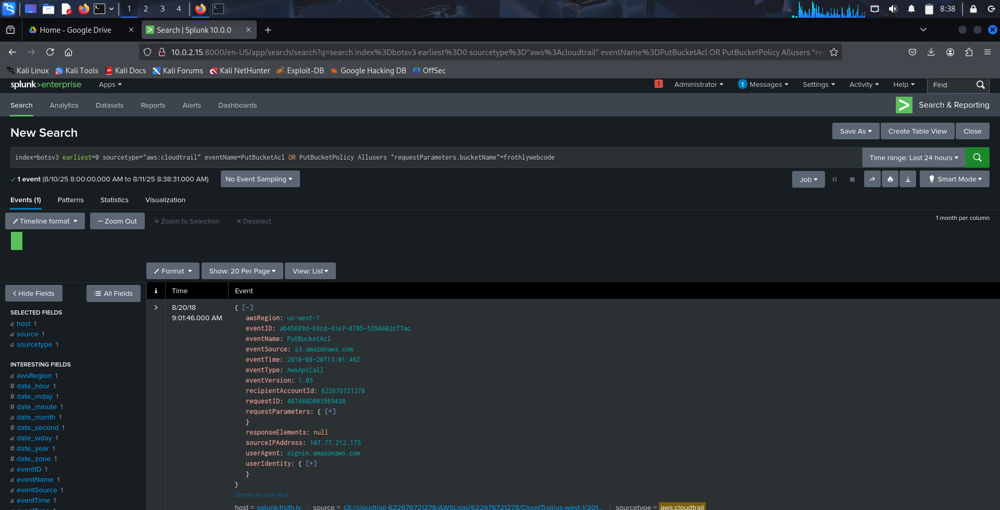
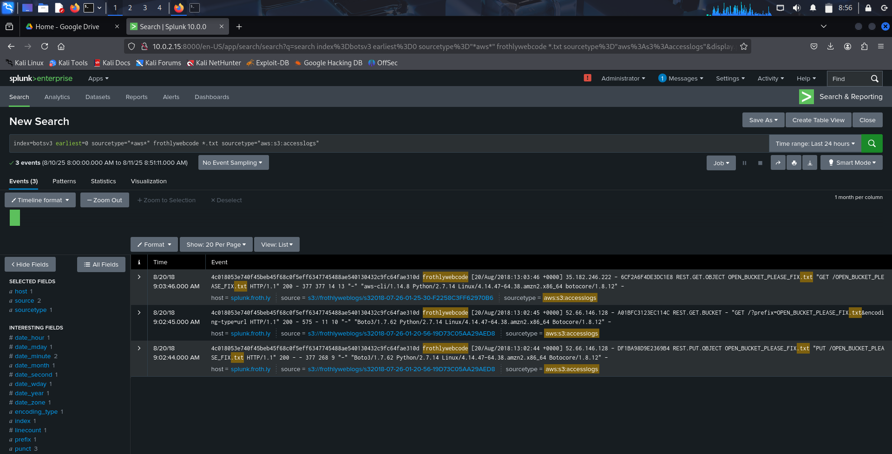
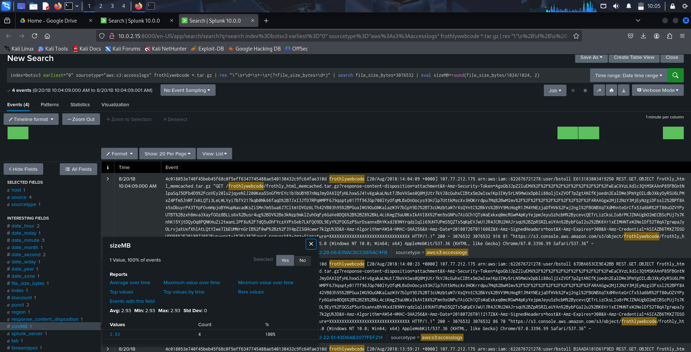
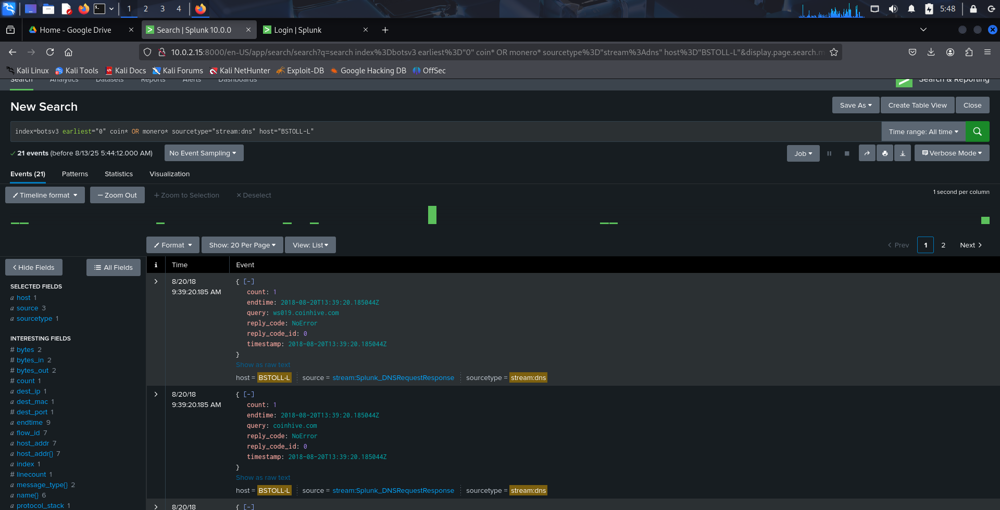
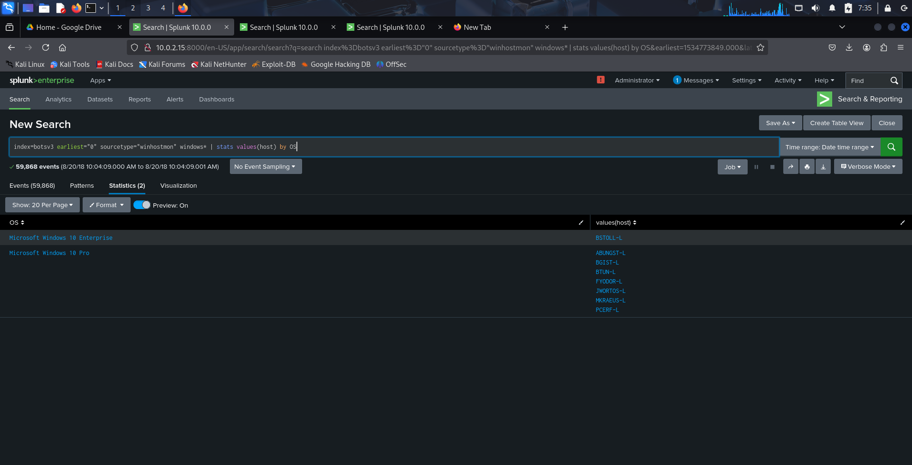
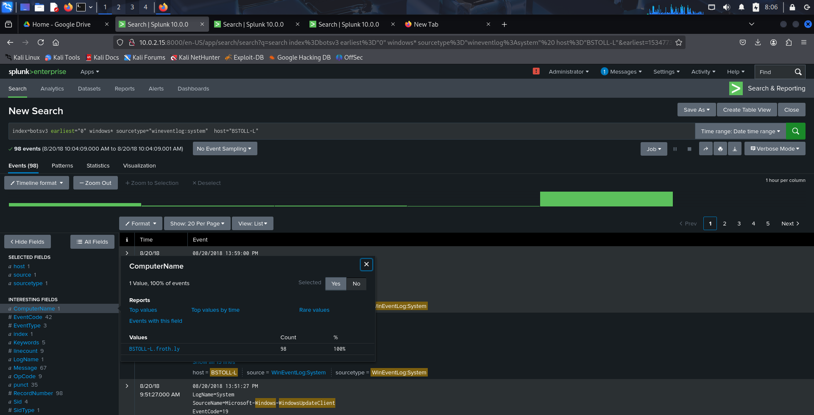

# Security Monitoring with Splunk – SOC Investigation Project

## 📌 Project Overview
This project demonstrates a hands-on **Security Operations Center (SOC) investigation** using **Splunk** and the **BOTSv3 dataset**.  
The objective was to analyze cloud, endpoint, and network logs to identify misconfigurations, suspicious activity, and potential compromise in Frothly’s environment.

The project mirrors real-world SOC analyst workflows, focusing not just on answers, but on how investigations are approached, validated, and concluded.

The goal was to simulate real SOC analyst tasks such as:

Identifying IAM user activity

Investigating cloud misconfigurations

Tracking suspicious file uploads

Detecting cryptocurrency mining on endpoints

Identifying anomalous operating systems

---

## 🛠 Tools & Technologies
- Splunk Enterprise
- BOTSv3 Dataset
- AWS CloudTrail Logs
- AWS S3 Access Logs
- Windows Event Logs
- Stream (DNS & Network Traffic)

---

## 📂 Dataset Information
- **Index:** `botsv3`
- **Key Sourcetypes:**  
  `aws:cloudtrail`, `aws:s3:accesslogs`, `hardware`, `winhostmon`,  
  `wineventlog:system`, `stream:dns`

---

## 🔍 Investigation Tasks & Findings

---

## **Question 1: IAM Users Who Accessed AWS Services**

### 🎯 Objective
List IAM users that accessed AWS services (successfully or unsuccessfully).

### 🧠 Investigation Approach
To identify IAM users interacting with AWS services in Frothly’s environment, I first determined how AWS activity is logged. AWS API calls—both successful and failed—are captured in **CloudTrail logs**, which are indexed in Splunk under the `aws:cloudtrail` sourcetype.

Based on AWS log structure, IAM usernames are stored in the userIdentity.userName field. Rather than filtering only successful events, I intentionally included all activity to gain full visibility into user behavior.

Using statistical aggregation allowed me to identify which IAM users were active and how frequently they accessed AWS services, a common SOC technique for spotting abnormal or high-risk accounts.

### 🔎 Splunk Query
spl
index="botsv3" earliest=0 sourcetype="aws:cloudtrail"
| stats count by userIdentity.userName
| sort -count

Findings

Splunk_access

Web_admin

Bstoll

btun

📸 **IAM Users Accessing AWS Services**

Question 2: Processor Number Used on Web Servers

Objective: Identify the processor number used on Frothly web servers.

🧠 Investigation Approach

An initial keyword search for processor vendors (Intel or AMD) returned thousands of unrelated events. Since processor details are hardware-level information, I refined the search to the hardware sourcetype to reduce noise.

This revealed a small number of hosts reporting CPU details. To determine which of these were web servers, I pivoted on each host and looked for web-related activity. The presence of stream:http traffic and the Apache banner (Apache 2.2.34 (Amazon)) confirmed the web server role.

Once validated, I correlated the shared CPU_TYPE field across these hosts to identify the processor number used by the web servers.

### 🔎Splunk Queries:
spl
index="botsv3" earliest=0 intel OR amd sourcetype="hardware"

index="botsv3" earliest=0 
host="gacrux.i-06fea586f3d3c8ce8" OR 
host="gacrux.i-09cbc261e84259b54" OR 
host="gacrux.i-0cc93bade2b3cba63"

Finding:

Processor Number: E5-2676 v3

📸 **Processor Number Used On Web Server**

Question 3: Event ID That Enabled Public S3 Access

Objective: Identify the API call event that made an S3 bucket public.

🧠 Investigation Approach

To determine how public access was enabled, I focused on CloudTrail events related to S3 permission changes. AWS documentation shows that PutBucketAcl and PutBucketPolicy are used to modify bucket access.

Public exposure is commonly associated with permissions granted to the AllUsers group. Filtering for these conditions narrowed the results to a single high-confidence event, allowing me to identify the exact API call responsible for the misconfiguration.

### 🔎Splunk Query:
spl
index="botsv3" earliest=0 sourcetype="aws:cloudtrail" 
eventName=PutBucketAcl OR PutBucketPolicy AllUsers

Finding:

Event ID: ab45689d-69cd-41e7-8705-5350402cf7ac

📸 **S3 Public Event Id**

Question 4: Publicly Accessible S3 Bucket Name

Objective: Identify the affected S3 bucket.

🧠 Investigation Approach

After identifying the API call responsible for the exposure, I inspected the request parameters within the same CloudTrail event. AWS logs store the affected bucket name in the requestParameters.bucketName field.

Using this field ensured accuracy and avoided introducing unrelated S3 activity.

### 🔎Splunk Query:
spl
index="botsv3" earliest=0 sourcetype="aws:cloudtrail" 
eventName=PutBucketAcl OR PutBucketPolicy AllUsers 
requestParameters.bucketName=frothlywebcode

Finding:

Bucket Name: frothlywebcode

📸 **S3 Bucket Name**:

Question 5: Text File Uploaded During Public Access

Objective: Identify the .txt file uploaded while the bucket was public.

🧠 Investigation Approach

With the bucket identified, I pivoted to S3 access logs, which record object-level operations such as uploads. Since the question referenced a text file, I filtered for .txt objects associated with the exposed bucket.

This approach isolated the relevant upload event without unnecessary path information.

### 🔎Splunk Query:
spl
index="botsv3" earliest=0 sourcetype="aws:s3:accesslogs" 
frothlywebcode "*.txt"

Finding:

File Name: OPEN_BUCKET_PLEASE_FIX.txt

📸 **Text Upload**:

Question 6: Size of Uploaded .tar.gz File

Objective: Determine the file size of the uploaded archive.

🧠 Investigation Approach

The filename was visible in S3 access logs, but the file size was embedded within raw log text rather than a parsed field. I inspected the _raw logs to locate the size value and then used a regular expression to extract it.

The extracted value was converted from bytes to megabytes and rounded to two decimal places as required.

### 🔎Splunk Query:
spl
index=botsv3 earliest=0 sourcetype="aws:s3:accesslogs" 
frothlywebcode "*.tar.gz"
| rex "\"\s+\d+\s+-\s+(?<file_size_bytes>\d+)"
| eval sizeMB=round(file_size_bytes/1024/1024, 2)

Finding:

File Size: 2.93 MB

📸 **Targz Size**:

Question 7: Endpoint Mining Monero

Objective: Identify the endpoint mining Monero cryptocurrency.

🧠 Investigation Approach

I began by hunting for cryptocurrency-related keywords such as coin* and monero*. To validate actual mining activity, I focused on DNS traffic, since mining requires communication with known mining infrastructure.

Filtering on stream:dns and correlating request and response traffic allowed me to eliminate false positives and identify the single endpoint actively communicating with mining-related domains.

### 🔎Splunk Query:
spl
index="botsv3" earliest=0 coin* OR monero* 
sourcetype="stream:dns" host="BSTOLL-L"

Finding:

Short Hostname: BSTOLL-L

📸 **Endpoint Mining**:

Question 8: Endpoint with Different Windows OS

Objective: Identify the endpoint running a different Windows edition.

🧠 Investigation Approach

Operating system data is logged through host monitoring sources. I grouped hosts by OS using statistical aggregation to quickly identify anomalies.

Once the outlier was identified, I pivoted to Windows system event logs to retrieve its fully qualified domain name (FQDN).

### 🔎Splunk Queries:
spl
index="botsv3" earliest=0 sourcetype="winhostmon" window*
| stats values(host) by OS

index="botsv3" earliest=0 sourcetype="wineventlog:system" 
window* host="BSTOLL-L"

Finding:

FQDN: BSTOLL-L.froth.ly

📸 **Windows Os**:

📌 Key Takeaways

Applied real SOC investigative thinking, not just SPL execution

Correlated cloud, endpoint, and network logs

Identified cloud misconfigurations and endpoint compromise

Demonstrated log analysis, validation, and root-cause investigation

📎 Author

Myra Moses Gomba
SOC & Cybersecurity Analyst (Entry-Level)
🔗 GitHub | LinkedIn | Medium
